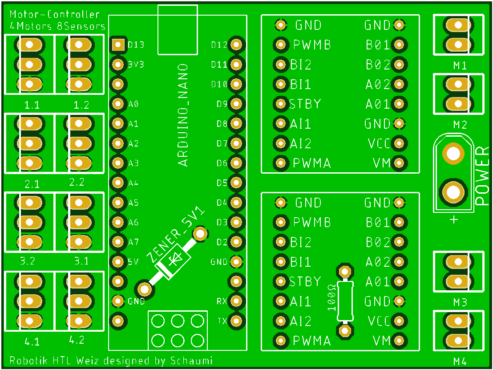

# InMoov_HTLWeiz

### Motor Controller Pinout:

|           |                   |     PWM    |      Dir   |           
|-----------|-------------------|------------|------------|
|     M1    |     S1.1 -> A1    |     D11    |     D12    |
|           |     S1.2 -> A0    |            |     D13    |
|     M2    |     S2.1 -> A3    |     D9     |     D10    |
|           |     S2.2 -> A2    |            |     D8     |
|     M3    |     S3.1 -> A4    |     D6     |     D5     |
|           |     S3.2 -> A5    |            |     D7     |
|     M4    |     S4.1 -> A6    |     D3     |     D4     |
|           |     S4.2 -> A7    |            |     D2     |

### Hüft Belegung:
Servo: Range:45°-115° Signal:A0 11:HIGH 12:HIGH 13:LOW

### Stuff to do:

#### Software(Andrea):
*
     - [ ] Skeleton tracking
     - [ ] Follow me
     - [ ] Pokal detection maybe take + hold or with tablet
     - [ ] Speech recognition
     
####	New software-core IO(Thomas):
Wenn motor dreht und poti ned ändert, fehler!!!
Wenn motor dreht und poti in di falsche richtung ändert, fehler!!!
*	Out:
     - [X] Servo/Actuators
     - [ ] Speech/Sounds
     - [ ] Mobility
     - [X] Connected Actuator Boards
     - [X] Actuator Angles (Maybe Visu)
*	IN: 
     - [ ] Speech
     - [ ] Position
     - [ ] Distance/Angle to Obstacle
     - [ ] Distance/Angle to Person
     - [ ] Distance/Angle/Height of Object
     - [ ] Gyro Data for stabilization
*	Pre-Input: 
     - [ ] gestures/Commands
     - [ ] Voice Lines
     - [X] Actuator Limits
     - [ ] Operation Limits (Virtual Border)

*    Aktuator Code Upgrade(Mainly Hands):
     - [ ] Smooth(Speed)
     - [ ] stay active

####	Electrical(Schaumi):
*
     - [X] Actuator-Boards more 5V Power
     - [X] New Motor Controller PCB
     - [ ] Collision avoidance Lidar or Camera
     - [ ] Floor detection
     - [ ] Gyro-Sensor (Chest)

####	Mechanical(Rauber):
*
     - [ ] Hall sensor Angle
     - [ ] Shoulder out-Actuator
     - [ ] Tablet holder

### Protocols:
*
     - InMoovACP (Arduino Connect Protocol):
          - 2 Bytes <- Protocol length
          - 1st Byte:
            - 1 = BoardMotorController,
            -  2 = RGB,
            -  3 = Left hand side,
            -  4 = Middle,
            -  5 = Right hand side
          - 2nd Byte:
            - 0 = not Used (if 1st Byte is 1 or 2)
            - 1 = Hand,
            - 2 = Head,
            - 3 = Actuator (since there is max one per side)

*
     - InMoovSDTP (Serial Data Transfer Protocol):
          - 5 Bytes <- Protocol length
            - 1st Byte: ACP-Byte 1
            - 2nd Byte: ACP-Byte 2
            - 3rd Byte: Servo/Motor number
            - 4th Byte: Angle of Servo/Motor
